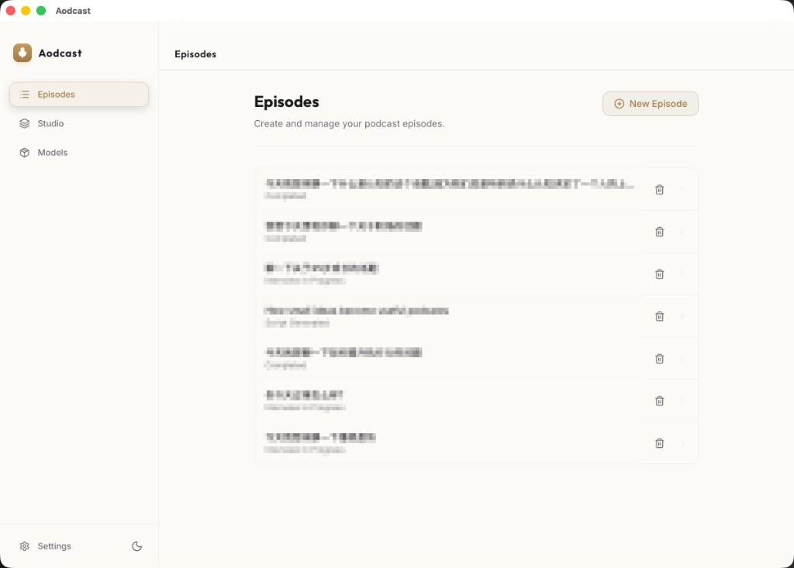
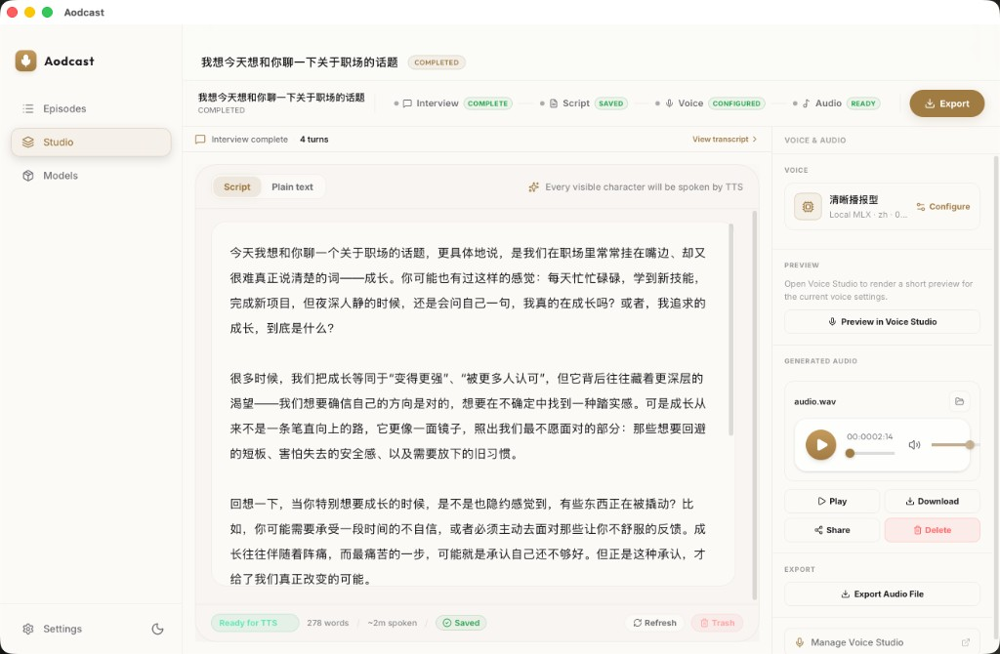
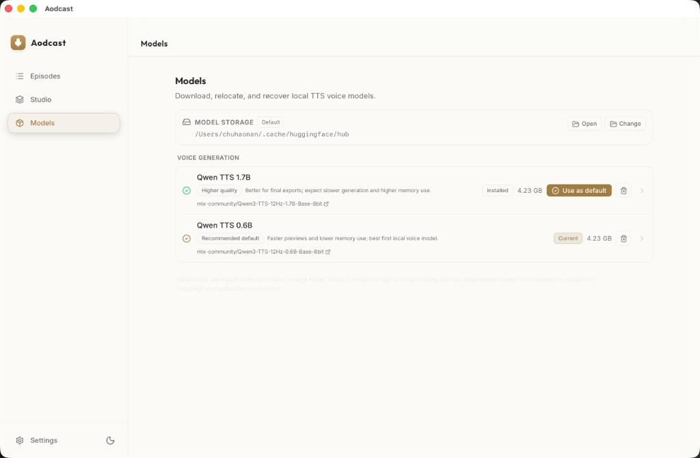

# Aodcast

[](https://github.com/Handsomemikezzz/Aodcast/actions/workflows/ci.yml)


English | [简体中文](README.zh-CN.md)

Aodcast is an open-source, local-first macOS desktop app for turning a text idea into a solo podcast script and final audio.

The app runs as a Tauri desktop shell backed by a local Python HTTP runtime. It guides the user through an interview, generates editable script snapshots, lets the user choose a reusable voice profile, and renders final audio through local or remote speech providers.

> Status: source-code alpha. Aodcast is usable for local development, but it is not yet a hardened packaged desktop distribution. Provider keys and generated content are stored locally; there is no Keychain or dedicated secret vault integration yet.

## What Works

- Text-topic podcast creation with an interview-guided writing flow.
- Multiple script snapshots per interview session.
- Script Workbench for editing, saving, deleting unused snapshots, choosing a voice profile, and rendering/reviewing generated audio.
- Voice Studio for built-in and user-created voice profiles, sample upload/recording, preview rendering, and profile management.
- Local MLX TTS on supported macOS machines, plus OpenAI-compatible remote provider adapters.
- Models page for local model storage, downloads, migration, reset, and default local voice model selection.
- Mock LLM and TTS providers for local smoke testing without paid provider access.
- Local-first development storage under `.local-data/`.

## Screenshots

### Episodes

Create and manage podcast episodes from the home screen.



### Studio

Follow the interview → script → voice → audio workflow in one workspace.



### Models

Download, relocate, and manage local MLX TTS voice models.



To refresh screenshots later: run `./scripts/dev/run-dev-all.sh`, capture the current UI, save stable filenames under `images/`, and update both `README.md` and `README.zh-CN.md`. Do not include API keys, local paths, private prompts, or user data.

## Requirements

- macOS for the desktop app
- Python 3.13+
- `uv`
- Node.js
- `pnpm`
- Rust and Cargo
- `curl` and `lsof` for the development launcher

Check the local toolchain:

```bash
./scripts/dev/check-toolchain.sh
```

## Quick Start

From the repository root:

```bash
cd services/python-core
uv venv .venv
uv pip install --python .venv/bin/python -e .

cd ../../apps/desktop
pnpm install

cd ../..
./scripts/dev/run-dev-all.sh
```

`run-dev-all.sh` starts the Python runtime on `127.0.0.1:8765`, clears stale development server state, and launches the Tauri development app. The Vite web server is served at `http://localhost:1420`.

## First Smoke Test

Use mock providers first. This verifies the app flow without paid API access or local model weights:

```bash
./scripts/dev/run-python-core.sh --configure-llm-provider mock
./scripts/dev/run-python-core.sh --configure-tts-provider mock_remote
./scripts/dev/run-python-core.sh --create-demo-session
./scripts/dev/run-dev-all.sh
```

In the app, create or open a session, continue the interview, generate a script, and render audio from Script Workbench.

## Provider Setup

Provider settings are stored locally under `.local-data/` and are not intended for version control.

### Development Mock Providers

Use mock providers for smoke testing without paid API access or local model weights:

```bash
./scripts/dev/run-python-core.sh --configure-llm-provider mock
./scripts/dev/run-python-core.sh --configure-tts-provider mock_remote
```

Check whether the saved LLM configuration is ready for interview and script generation:

```bash
./scripts/dev/run-python-core.sh --check-llm-config
```

### OpenAI-Compatible Providers

Configure an OpenAI-compatible LLM provider:

```bash
./scripts/dev/run-python-core.sh \
  --configure-llm-provider openai_compatible \
  --llm-base-url "https://api.openai.com/v1" \
  --llm-model "gpt-4o-mini" \
  --llm-api-key "<your-key>"
```

Configure an OpenAI-compatible TTS provider:

```bash
./scripts/dev/run-python-core.sh \
  --configure-tts-provider openai_compatible \
  --tts-base-url "https://api.openai.com/v1" \
  --tts-model "gpt-4o-mini-tts" \
  --tts-api-key "<your-key>" \
  --tts-voice "alloy" \
  --tts-audio-format "wav"
```

### Environment Variables

Aodcast does not require a `.env` file for normal development. `.env.example` documents optional helper-script variables such as `AODCAST_HF_MODEL_BASE`, `HF_HUB_CACHE`, and `HF_TOKEN`.

### Local MLX TTS

Local MLX TTS is a primary first-release capability for local-first speech generation on supported macOS machines, preferably Apple Silicon, with enough disk space and unified memory for the selected model.

Install the optional dependency group:

```bash
cd services/python-core
uv venv .venv
uv pip install --python .venv/bin/python -e '.[local-mlx]'
cd ../..
```

Default model target:

```text
mlx-community/Qwen3-TTS-12Hz-0.6B-Base-8bit
```

Download model weights into a user-owned model directory:

```bash
uv run --with huggingface_hub --with tqdm \
  scripts/model-download/download_qwen3_tts_mlx.py \
  --base-dir "${HF_HUB_CACHE:-$HOME/.cache/huggingface/hub}"
```

If a repository requires authentication, pass `--token` or set `HF_TOKEN` locally. Do not commit tokens.

The local MLX path is runtime-gated. Always check capability before selecting it:

```bash
./scripts/dev/run-python-core.sh --show-local-tts-capability
```

The capability report is the source of truth. It checks the platform, Python environment, MLX imports, model path, and bootstrap behavior.

Configure local MLX in repo-id mode:

```bash
./scripts/dev/run-python-core.sh \
  --configure-tts-provider local_mlx \
  --clear-tts-local-model-path
```

Or point to an explicit local model directory:

```bash
./scripts/dev/run-python-core.sh \
  --configure-tts-provider local_mlx \
  --tts-local-model-path "${HF_HUB_CACHE:-$HOME/.cache/huggingface/hub}/Qwen3-TTS-12Hz-0.6B-Base-8bit"
```

A local model directory must contain a real MLX export, including `.safetensors` weights. Placeholder directories are useful for tests but are not executable model bundles.

#### Manage model storage in the desktop app

The desktop **Models** page is the preferred way to manage local model files:

- it shows the active model storage folder
- it can open that folder in Finder from the Tauri shell
- it can change the storage folder and migrate existing Aodcast model directories
- it can reset storage back to the default cache base
- it shows inline download progress and recoverable error details

For first-run reliability behind local proxy/VPN setups, Aodcast disables the Hugging Face Xet transfer path for app-managed model downloads and uses the direct HTTP downloader instead.

The app stores the chosen custom model base in local config. Resetting storage clears that custom app setting; environment variables such as `AODCAST_HF_MODEL_BASE` or `HF_HUB_CACHE` still affect the computed default base.

CLI equivalents:

```bash
./scripts/dev/run-python-core.sh --show-model-storage
./scripts/dev/run-python-core.sh --migrate-model-storage /path/to/aodcast-models
./scripts/dev/run-python-core.sh --reset-model-storage
```

#### Validate with a render

Use mock LLM if you only want to validate the audio path:

```bash
./scripts/dev/run-python-core.sh --configure-llm-provider mock
./scripts/dev/run-python-core.sh --create-demo-session
./scripts/dev/run-python-core.sh --configure-tts-provider local_mlx --clear-tts-local-model-path
./scripts/dev/run-python-core.sh --render-audio <session-id>
```

#### Local MLX notes and limitations

- First render may be slow because the worker loads the model.
- Long scripts are chunked and joined by the project runner.
- Voice Studio preview rendering is a pollable long task.
- Aodcast does not currently provide voice cloning.
- `.mp4` support is audio-container support when the selected provider/runtime creates a valid file; Aodcast does not currently transcode WAV to video MP4.

## Development Commands

Run the desktop app with the local runtime:

```bash
./scripts/dev/run-dev-all.sh
```

Run the Python runtime directly:

```bash
./scripts/dev/run-python-core.sh --serve-http --host 127.0.0.1 --port 8765
```

Run frontend checks:

```bash
pnpm --dir apps/desktop check
pnpm --dir apps/desktop build:web
```

Run Rust checks for the Tauri shell:

```bash
cd apps/desktop/src-tauri
cargo check
```

Run Python tests:

```bash
cd services/python-core
.venv/bin/python -m unittest discover -s tests -v
```

Run the repository hygiene check:

```bash
./scripts/maintenance/run-repo-hygiene-check.sh
```

## Repository Layout

- `apps/desktop`: Tauri UI, React routes, desktop shell commands, and frontend bridge code.
- `services/python-core`: interview orchestration, script generation, provider dispatch, local storage, artifacts, and HTTP runtime.
- `packages/shared-schemas`: shared frontend/backend contract schemas.
- `scripts`: development, maintenance, release, and model-download helpers.
- `docs`: gitignored local scratch (for example `tmp.md`, `plan.md`); setup docs live in README and AGENTS.md.
- `examples`: sample placeholders and examples.

Useful docs:

- [Agent collaboration contract](AGENTS.md)
- [Contributing guide](CONTRIBUTING.md)
- [Security policy](SECURITY.md)

## Data And Privacy

Aodcast is local-first. During development, generated sessions, scripts, transcripts, audio artifacts, provider configuration, and request-state files are stored under:

```text
.local-data/
```

This directory is ignored by Git and must not be committed.

API keys are stored as local user-managed configuration. Aodcast does not currently provide macOS Keychain integration or a dedicated secrets vault. Protect local config files, shell history, logs, screenshots, backups, synced folders, generated transcripts, and generated audio.

Long-term memory is local-only. When enabled, Aodcast saves a small set of reusable user knowledge as Markdown files under `.local-data/memory/` so interviews and scripts can stay consistent across episodes. Memory is opt-in (first-run notice), can be turned off per episode or globally, and is fully viewable and deletable. High-sensitivity secrets (passwords, API keys, payment credentials, full ID numbers, precise addresses) are never saved, even on request.

Do not open public issues or pull requests containing API keys, private prompts, private generated content, local data paths, transcripts, or audio artifacts.

## Current Scope

Aodcast currently focuses on local-first solo podcast creation. The repository does not include speech-to-text input, cloud backend hosting, multi-host podcast formats, or voice cloning.

The app can serve common audio suffixes and can prepare some uploaded profile samples as WAV references when `ffmpeg` or `afconvert` is available. Export to compressed audio formats depends on local conversion tools. True video MP4 output is out of scope.

## Contributing

Contributions are welcome. Keep changes small, update docs when behavior changes, and run the relevant verification commands before opening a pull request.

Do not commit `.local-data/`, `.env`, model weights, generated audio, transcripts, virtual environments, `node_modules`, build outputs, or private credentials.

See [CONTRIBUTING.md](CONTRIBUTING.md) for the full contribution guide.

## Security

If you find a vulnerability, do not open a public issue with exploit details. Report it privately to `cxh1210@mail.ustc.edu.cn` or follow [SECURITY.md](SECURITY.md).

## License

Aodcast is released under the [MIT License](LICENSE).
