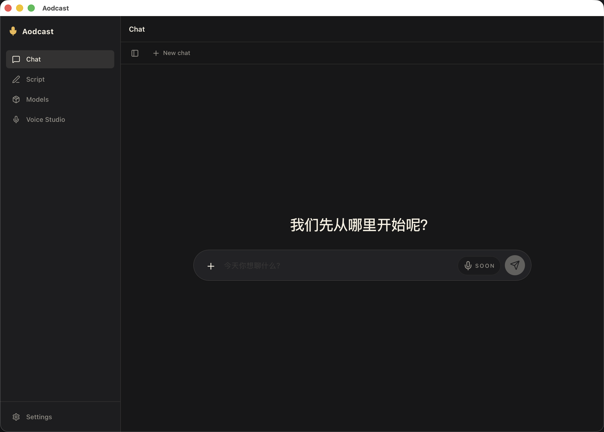
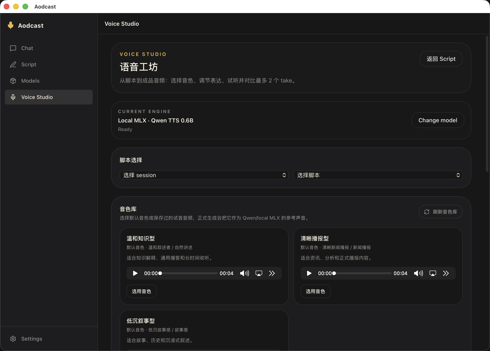
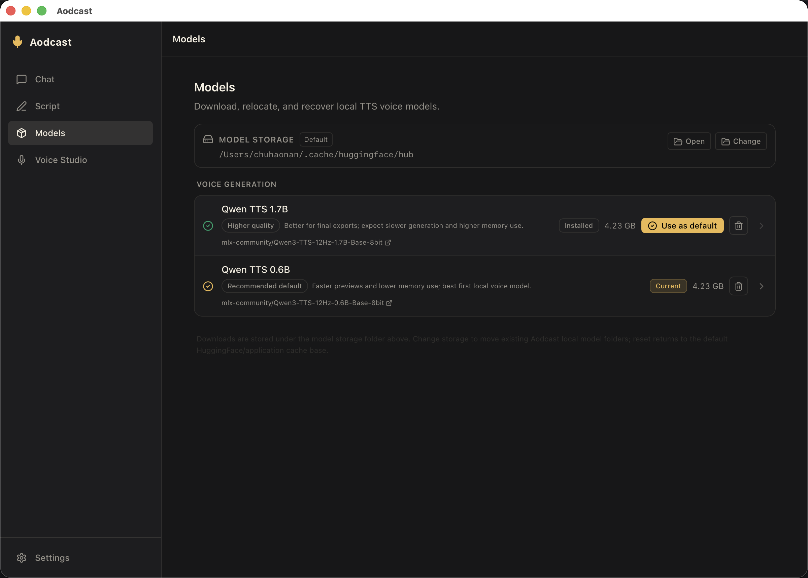
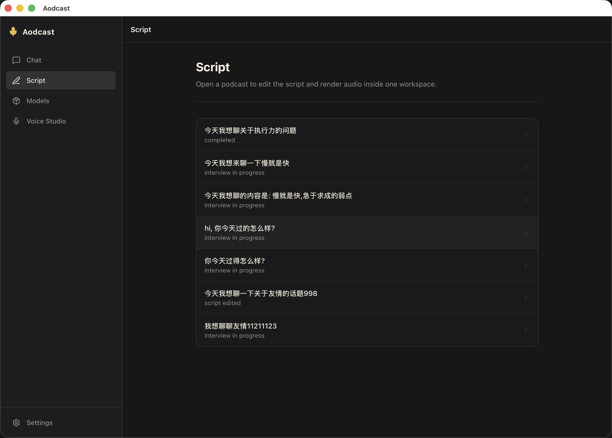

# Aodcast


Aodcast is an open-source, local-first macOS desktop app for turning a text idea into a solo podcast script and final audio.

The app runs as a Tauri desktop shell backed by a local Python HTTP runtime. It guides the user through an interview, generates editable script snapshots, lets the user choose a reusable voice profile, and renders final audio through local or remote speech providers.

## Features

- Text-topic podcast creation with an interview-guided writing flow.
- Multiple script snapshots per interview session, each with independent editing and audio output.
- Script Workbench for editing, formatting, saving, deleting unused snapshots, and reviewing generated audio.
- Inline voice selection from the script page before final audio generation.
- Voice Studio for built-in and user-created voice profiles, sample upload/recording, preview rendering, and profile management.
- Local MLX TTS support for supported macOS machines, plus OpenAI-compatible remote provider adapters.
- Models page for local model storage, downloads, migration, reset, and default local voice model selection.
- Mock LLM and TTS providers for local smoke testing without paid provider access.
- Local-first storage under `.local-data/` during development.

## Screenshots

### App Overview



### Interview Flow



### Script Workbench



### Voice Studio



## Requirements

- macOS for the desktop app
- Python 3.13+
- `uv`
- Node.js
- `pnpm`
- Rust and Cargo

For local MLX TTS, use a supported macOS machine, preferably Apple Silicon, with enough disk space and unified memory for the selected model. Always run the capability check before selecting the local MLX provider.

Check the local toolchain:

```bash
./scripts/dev/check-toolchain.sh
```

## Quick Start

From the repository root:

```bash
cd services/python-core
uv venv .venv
uv pip install --python .venv/bin/python -e .

cd ../../apps/desktop
pnpm install

cd ../..
./scripts/dev/run-dev-all.sh
```

`run-dev-all.sh` starts the Python runtime on `127.0.0.1:8765`, clears stale development server state, and launches the Tauri development app. The Vite web server is served at `http://localhost:1420`.

## Provider Setup

Mock providers are useful for smoke testing the app flow:

```bash
./scripts/dev/run-python-core.sh --configure-llm-provider mock
./scripts/dev/run-python-core.sh --configure-tts-provider mock_remote
./scripts/dev/run-python-core.sh --create-demo-session
```

OpenAI-compatible provider adapters can be configured from the Python core CLI:

```bash
./scripts/dev/run-python-core.sh \
  --configure-llm-provider openai_compatible \
  --llm-base-url "https://api.openai.com/v1" \
  --llm-model "gpt-4o-mini" \
  --llm-api-key "<your-key>"

./scripts/dev/run-python-core.sh \
  --configure-tts-provider openai_compatible \
  --tts-base-url "https://api.openai.com/v1" \
  --tts-model "gpt-4o-mini-tts" \
  --tts-api-key "<your-key>" \
  --tts-voice "alloy" \
  --tts-audio-format "wav"
```

See [Configuration](docs/configuration.md) for provider details, optional environment variables, and API key handling notes.

## Local MLX TTS

Install the optional local MLX dependency group:

```bash
cd services/python-core
uv pip install --python .venv/bin/python -e '.[local-mlx]'
cd ../..
```

Download the default model:

```bash
uv run --with huggingface_hub --with tqdm \
  scripts/model-download/download_qwen3_tts_mlx.py \
  --base-dir "${HF_HUB_CACHE:-$HOME/.cache/huggingface/hub}"
```

Check local MLX capability:

```bash
./scripts/dev/run-python-core.sh --show-local-tts-capability
```

Configure the local MLX TTS provider in repo-id mode:

```bash
./scripts/dev/run-python-core.sh \
  --configure-tts-provider local_mlx \
  --clear-tts-local-model-path
```

See [Local MLX quickstart](docs/local-mlx-quickstart.md) for model storage, troubleshooting, and hardware notes.

## Repository Layout

- `apps/desktop`: Tauri UI, React routes, desktop shell commands, and frontend bridge code.
- `services/python-core`: interview orchestration, script generation, provider dispatch, local storage, artifacts, and HTTP runtime.
- `packages/shared-schemas`: shared frontend/backend contract schemas.
- `scripts`: development, maintenance, release, and model-download helpers.
- `docs/product`: product behavior notes.
- `docs/architecture`: architecture and repository layout notes.
- `docs/operations`: maintenance and agent workflow docs.
- `examples`: sample placeholders and examples.

Useful docs:

- [Product overview](docs/product/product-overview.md)
- [Configuration](docs/configuration.md)
- [Local MLX quickstart](docs/local-mlx-quickstart.md)
- [Repository layout](docs/architecture/repository-layout.md)
- [Contributing guide](CONTRIBUTING.md)
- [Security policy](SECURITY.md)

## Development Commands

Run the desktop app with the local runtime:

```bash
./scripts/dev/run-dev-all.sh
```

Run the Python runtime directly:

```bash
./scripts/dev/run-python-core.sh --serve-http --host 127.0.0.1 --port 8765
```

Run frontend checks:

```bash
pnpm --dir apps/desktop check
pnpm --dir apps/desktop build:web
```

Run Rust checks for the Tauri shell:

```bash
cd apps/desktop/src-tauri
cargo check
```

Run Python tests:

```bash
cd services/python-core
uv run --with pytest python -m pytest tests
```

Run the repository hygiene check:

```bash
./scripts/maintenance/run-repo-hygiene-check.sh
```

## Data And Privacy

Aodcast is local-first. During development, generated sessions, scripts, transcripts, audio artifacts, provider configuration, and request-state files are stored under:

```text
.local-data/
```

This directory is ignored by Git and must not be committed.

API keys are stored as local user-managed configuration. Aodcast does not currently provide macOS Keychain integration or a dedicated secrets vault. Protect local config files, shell history, logs, screenshots, backups, synced folders, generated transcripts, and generated audio.

Do not open public issues or pull requests containing API keys, private prompts, private generated content, local data paths, transcripts, or audio artifacts.

## Current Scope

Aodcast currently focuses on local-first solo podcast creation. The repository does not include speech-to-text input, long-term user memory, cloud backend hosting, multi-host podcast formats, or voice cloning.

The app can serve common audio suffixes and can prepare some uploaded profile samples as WAV references when `ffmpeg` or `afconvert` is available. It does not guarantee generated WAV to AAC/M4A/MP4 transcoding or true video MP4 output.

## Contributing

Contributions are welcome. Keep changes small, update docs when behavior changes, and run the relevant verification commands before opening a pull request.

Do not commit `.local-data/`, `.env`, model weights, generated audio, transcripts, virtual environments, `node_modules`, build outputs, or private credentials.

See [CONTRIBUTING.md](CONTRIBUTING.md) for the full contribution guide.

## Security

If you find a vulnerability, do not open a public issue with exploit details. Follow the private reporting guidance in [SECURITY.md](SECURITY.md).

## License

Aodcast is released under the [MIT License](LICENSE).
