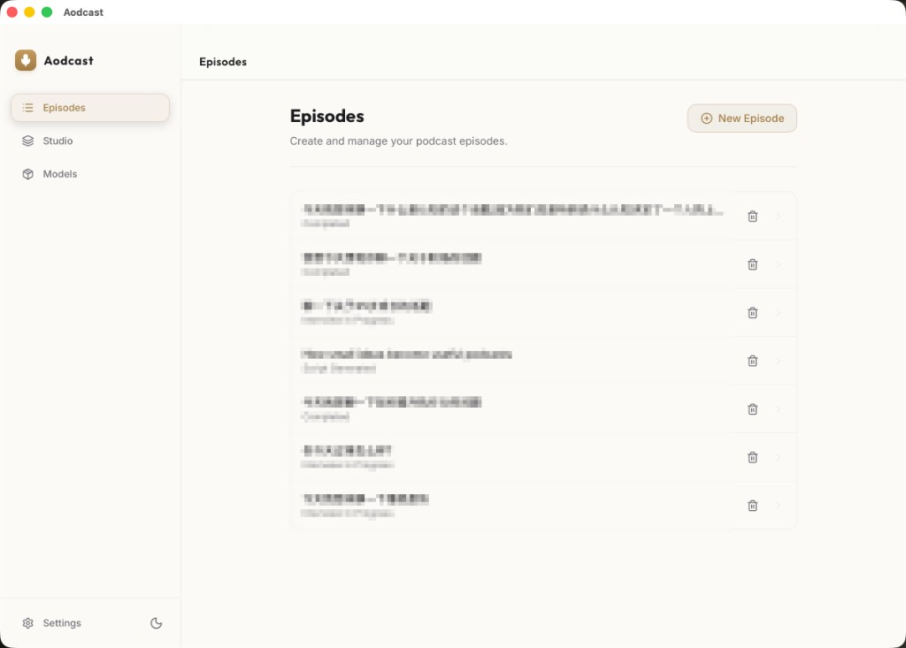
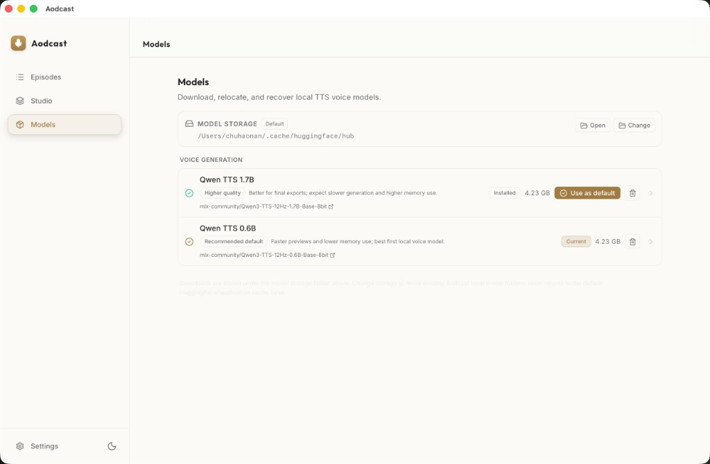

# Aodcast

[](https://github.com/Handsomemikezzz/Aodcast/actions/workflows/ci.yml)


English | [简体中文](README.zh-CN.md)

Aodcast is an open-source, local-first macOS desktop app for turning a text idea or an existing Markdown article into a solo podcast script and final audio.

The app runs as a Tauri desktop shell backed by a local Python HTTP runtime. It guides the user through an interview, generates editable script snapshots, lets the user choose a reusable Speaker Reference and speech model, and renders final audio through local or remote speech providers.

> Status: source-code alpha. Aodcast is usable for local development, but it is not yet a hardened packaged desktop distribution. Provider keys and generated content are stored locally; there is no Keychain or dedicated secret vault integration yet.

## What Works

- Text-topic podcast creation with an interview-guided writing flow.
- Markdown-first creation from a local `.md` file or pasted text, with source preview, podcast adaptation or faithful narration, target-length guidance, optional source discussion, and versioned source replacement.
- Multiple independent script snapshots per episode, regardless of whether it started from an interview or Markdown.
- A Podcast Editor stage that writes clean, listenable narration with deliberate sentence length, punctuation, and paragraph rhythm—without manufacturing filler words or stage directions.
- An internal Speech Director that creates a versioned, provider-neutral Speech Plan with stable segments, structured pauses, emphasis, pronunciation, and delivery guidance for the exact script hash without exposing those engineering concepts in the main UI.
- A script-first Episode Workspace for editing, contextual Voice and Delivery selection, short passage previews, full audio rendering, non-destructive audio updates, playback, and export.
- Voice Studio for built-in and user-created Speaker References, sample upload/recording up to 10 minutes, asset previews, and reference management; existing voices are selected directly inside an episode.
- Local MLX TTS model adapters on supported macOS machines, plus OpenAI-compatible remote providers. VoxCPM2 8-bit is the local default; MOSS-TTS Local v1.5 and Qwen3-TTS Base remain comparison paths.
- Manifest-driven WAV assembly with explicit pauses, consistent format/loudness, render lineage, and reusable per-segment audio assets.
- Models page for local model storage, downloads, migration, reset, and default local voice model selection.
- Mock LLM and TTS providers for local smoke testing without paid provider access.
- ChatGPT subscription LLM access through the official local Codex app-server, with browser sign-in, account model discovery, and Codex usage-window reporting.
- Local-first development storage under `.local-data/`.

## Screenshots

### Episodes

Create and manage podcast episodes from the home screen.



### Models

Download, relocate, and manage local MLX TTS voice models.



To refresh screenshots later: run `./scripts/dev/run-dev-all.sh`, capture the current UI, save stable filenames under `images/`, and update both `README.md` and `README.zh-CN.md`. Do not include API keys, local paths, private prompts, or user data.

## Requirements

- macOS for the desktop app
- Python 3.13+
- `uv`
- Node.js
- `pnpm`
- Rust and Cargo
- `curl` and `lsof` for the development launcher

Check the local toolchain:

```bash
./scripts/dev/check-toolchain.sh
```

## Quick Start

From the repository root:

```bash
cd services/python-core
uv venv .venv
uv pip install --python .venv/bin/python -e .

cd ../../apps/desktop
pnpm install

cd ../..
./scripts/dev/run-dev-all.sh
```

`run-dev-all.sh` starts the Python runtime on `127.0.0.1:8765`, clears stale development server state, and launches the Tauri development app. The Vite web server is served at `http://localhost:1420`.

## First Smoke Test

Use the mock LLM provider first. This verifies the interview and script flow without paid API access. TTS uses the local MLX engine (download a voice model from Models Center before rendering audio):

```bash
./scripts/dev/run-python-core.sh --configure-llm-provider mock
./scripts/dev/run-python-core.sh --configure-tts-provider local_mlx
./scripts/dev/run-python-core.sh --create-demo-session
./scripts/dev/run-dev-all.sh
```

In the app, create or open an episode, continue its conversation, create a draft, and preview or render audio from the Episode Workspace.

## Provider Setup

Provider settings are stored locally under `.local-data/` and are not intended for version control.

### Development Mock LLM

Use the mock LLM provider for smoke testing interview and script generation without paid API access:

```bash
./scripts/dev/run-python-core.sh --configure-llm-provider mock
./scripts/dev/run-python-core.sh --configure-tts-provider local_mlx
```

Check whether the saved LLM configuration is ready for interview and script generation:

```bash
./scripts/dev/run-python-core.sh --check-llm-config
```

### ChatGPT Subscription Through Codex

Install the official Codex CLI, then select **ChatGPT subscription (via Codex)** in Settings:

```bash
npm install -g @openai/codex
```

Aodcast starts the official local `codex app-server`, opens the ChatGPT browser sign-in flow, and discovers models available to that account. Interview, summary, script, Speech Plan, and memory calls use ephemeral Codex threads and consume the signed-in account's Codex plan allowance. Aodcast never reads or stores Codex access or refresh tokens and never silently falls back to API-key billing. The sign-in is shared with the official Codex CLI on the same machine.

Settings also exposes one global **Reasoning effort** selector for every Codex-backed LLM task. `Auto` omits the turn override and uses the selected model's reported default. Explicit choices are populated from that model's live `supportedReasoningEfforts`; switching models resets an unsupported saved choice to `Auto`. Higher effort can increase response time and consume the plan allowance faster.

For CLI-only configuration after the account is already signed in with `codex login`:

```bash
./scripts/dev/run-python-core.sh \
  --configure-llm-provider codex_subscription \
  --llm-model "gpt-5.6-sol" \
  --llm-reasoning-effort auto
```

### OpenAI-Compatible Providers

Configure an OpenAI-compatible LLM provider:

```bash
./scripts/dev/run-python-core.sh \
  --configure-llm-provider openai_compatible \
  --llm-base-url "https://api.openai.com/v1" \
  --llm-model "gpt-4o-mini" \
  --llm-api-key "<your-key>"
```

Configure an OpenAI-compatible TTS provider:

```bash
./scripts/dev/run-python-core.sh \
  --configure-tts-provider openai_compatible \
  --tts-base-url "https://api.openai.com/v1" \
  --tts-model "gpt-4o-mini-tts" \
  --tts-api-key "<your-key>" \
  --tts-voice "alloy" \
  --tts-audio-format "wav"
```

### Environment Variables

Aodcast does not require a `.env` file for normal development. `.env.example` documents optional helper variables such as `AODCAST_HF_MODEL_BASE`, `HF_HUB_CACHE`, `HF_TOKEN`, and `VITE_AODCAST_RUNTIME_URL` for pointing a parallel worktree's Vite shell at its own local runtime. If Codex is installed outside `PATH`, `/opt/homebrew/bin`, or `/usr/local/bin`, set `AODCAST_CODEX_BIN` to the absolute official Codex executable path.

### Exporting MP3

Final renders stay WAV. After audio exists, use **Export MP3** next to the final render.

- Aodcast writes a 192 kbps MP3 beside the WAV, for example `.local-data/exports/<session-id>/renders/<render-id>/podcast.mp3`.
- Finder opens on the MP3 so you can upload it to Xiaoyuzhou or any other host.
- Aodcast does not store platform credentials, upload audio, generate RSS, or track remote publication state.

### Local MLX TTS

Local MLX TTS is a primary first-release capability for local-first speech generation on supported macOS machines, preferably Apple Silicon, with enough disk space and unified memory for the selected model.

Install the optional dependency group:

```bash
cd services/python-core
uv venv .venv
uv pip install --python .venv/bin/python -e '.[local-mlx]'
cd ../..
```

This group pins `mlx-audio[tts]` to `0.4.6` so the model adapters and worker run against the tested TTS API surface.

Default model target:

```text
mlx-community/VoxCPM2-8bit
```

Download model weights into a user-owned model directory:

```bash
uv run --with huggingface_hub --with tqdm \
  scripts/model-download/download_tts_model.py \
  --base-dir "${HF_HUB_CACHE:-$HOME/.cache/huggingface/hub}"
```

The generic downloader defaults to VoxCPM2 8-bit. Pass a registered repository explicitly to download a comparison model, for example:

```bash
uv run --with huggingface_hub --with tqdm \
  scripts/model-download/download_tts_model.py \
  --repo-id OpenMOSS-Team/MOSS-TTS-Local-Transformer-v1.5 \
  --base-dir "${HF_HUB_CACHE:-$HOME/.cache/huggingface/hub}"
```

If a repository requires authentication, pass `--token` or set `HF_TOKEN` locally. Do not commit tokens.

The local MLX path is runtime-gated. Always check capability before selecting it:

```bash
./scripts/dev/run-python-core.sh --show-local-tts-capability
```

The capability report is the source of truth. It checks the platform, Python environment, MLX imports, model path, and bootstrap behavior. Each adapter also reports feature support as `native`, `approximated`, or `unsupported`; the runtime uses those declarations without exposing provider capability jargon in the primary Episode UI.

Current comparison set:

| Model | Role |
| --- | --- |
| `mlx-community/VoxCPM2-8bit` | Recommended default; combines Speaker Reference cloning with style/prosody instructions. |
| `OpenMOSS-Team/MOSS-TTS-Local-Transformer-v1.5` | High-memory long-form and explicit-pause comparison. |
| `mlx-community/Qwen3-TTS-12Hz-1.7B-Base-8bit` | Higher-quality cloning baseline without style instruction. |
| `mlx-community/Qwen3-TTS-12Hz-0.6B-Base-8bit` | Faster, lower-memory cloning baseline without style instruction. |

Configure local MLX in repo-id mode:

```bash
./scripts/dev/run-python-core.sh \
  --configure-tts-provider local_mlx \
  --clear-tts-local-model-path
```

Or point to an explicit local model directory:

```bash
./scripts/dev/run-python-core.sh \
  --configure-tts-provider local_mlx \
  --tts-local-model-path "${HF_HUB_CACHE:-$HOME/.cache/huggingface/hub}/VoxCPM2-8bit"
```

A local model directory must contain a real MLX export, including `.safetensors` weights. Placeholder directories are useful for tests but are not executable model bundles.

#### Manage model storage in the desktop app

The desktop **Models** page is the preferred way to manage local model files:

- it shows the active model storage folder
- it can open that folder in Finder from the Tauri shell
- it can change the storage folder and migrate existing Aodcast model directories
- it can reset storage back to the default cache base
- it shows inline download progress and recoverable error details

For first-run reliability behind local proxy/VPN setups, Aodcast disables the Hugging Face Xet transfer path for app-managed model downloads and uses the direct HTTP downloader instead.

The app stores the chosen custom model base in local config. Resetting storage clears that custom app setting; environment variables such as `AODCAST_HF_MODEL_BASE` or `HF_HUB_CACHE` still affect the computed default base.

CLI equivalents:

```bash
./scripts/dev/run-python-core.sh --show-model-storage
./scripts/dev/run-python-core.sh --migrate-model-storage /path/to/aodcast-models
./scripts/dev/run-python-core.sh --reset-model-storage
```

#### Validate with a render

Use mock LLM if you only want to validate the audio path:

```bash
./scripts/dev/run-python-core.sh --configure-llm-provider mock
./scripts/dev/run-python-core.sh --create-demo-session
./scripts/dev/run-python-core.sh --configure-tts-provider local_mlx --clear-tts-local-model-path
./scripts/dev/run-python-core.sh --render-audio <session-id>
```

#### Local MLX notes and limitations

- This alpha redesign does not migrate the removed voice-profile / preview-lock metadata. Recreate Speaker References after updating, or reset the development `.local-data/` directory when older fixtures prevent startup.
- First render may be slow because the worker loads the model.
- Full renders first create a Speech Plan, synthesize one WAV asset per segment, then assemble the final `podcast.wav` from the Render Manifest.
- Voice Studio preview rendering is a pollable long task. A preview is disposable; the selected persistent Speaker Reference defines the script's cloning source.
- Voice cloning is available when the selected model reports native Speaker Reference support. User recordings and uploads must be 10 minutes or shorter and include the matching reference transcript.
- MOSS provider pause markers are generated inside its adapter from structured Speech Plan breaks; they never become script text.
- `.mp4` support is audio-container support when the selected provider/runtime creates a valid file; Aodcast does not currently transcode WAV to video MP4.

## Development Commands

Run the desktop app with the local runtime:

```bash
./scripts/dev/run-dev-all.sh
```

Run the Python runtime directly:

```bash
./scripts/dev/run-python-core.sh --serve-http --host 127.0.0.1 --port 8765
```

Run frontend checks:

```bash
pnpm --dir apps/desktop check
pnpm --dir apps/desktop test
pnpm --dir apps/desktop build:web
```

Run Rust checks for the Tauri shell:

```bash
cd apps/desktop/src-tauri
cargo check
```

Run Python tests:

```bash
cd services/python-core
.venv/bin/python -m unittest discover -s tests -v
```

Run the repository hygiene check:

```bash
./scripts/maintenance/run-repo-hygiene-check.sh
```

## Repository Layout

- `apps/desktop`: Tauri UI, React routes, desktop shell commands, and frontend bridge code.
- `services/python-core`: interview orchestration, script generation, provider dispatch, local storage, artifacts, and HTTP runtime.
- `packages/shared-schemas`: shared frontend/backend contract schemas.
- `scripts`: development, maintenance, release, and model-download helpers.
- `docs`: gitignored local scratch (for example `tmp.md`, `plan.md`); human setup lives in README; agent constraints live in AGENTS.md.
- `examples`: sample placeholders and examples.

Useful docs:

- [Agent collaboration contract](AGENTS.md)
- [Contributing guide](CONTRIBUTING.md)
- [Security policy](SECURITY.md)

## Data And Privacy

Aodcast is local-first. During development, generated sessions, imported source snapshots, scripts, Speech Plans, Render Manifests, Speaker References, transcripts, audio artifacts, provider configuration, and request-state files are stored under:

```text
.local-data/
```

This directory is ignored by Git and must not be committed.

API keys are stored as local user-managed configuration. Aodcast does not currently provide macOS Keychain integration or a dedicated secrets vault. Protect local config files, shell history, logs, screenshots, backups, synced folders, generated transcripts, and generated audio.

For ChatGPT subscription access, Codex owns OAuth storage and token refresh. Aodcast receives only account status, plan labels, model metadata, rate-limit summaries, and the generated model output; OAuth tokens and browser cookies are never copied into Aodcast configuration or bridge payloads.

Imported Markdown is snapshotted under `.local-data/sessions/<session-id>/source.json`. Script generation sends the normalized article, generation preferences, and any supplemental source discussion to the configured LLM provider. When that provider is remote, this content leaves the device and is handled under the provider's terms. Imported source text is not converted into transcript turns and is never written into Aodcast long-term memory; only later user-authored conversation turns may be eligible for memory when memory is enabled.

Long-term memory is local-only. When enabled, Aodcast saves a small set of reusable user knowledge as Markdown files under `.local-data/memory/` so interviews and scripts can stay consistent across episodes. Memory is opt-in (first-run notice), can be turned off per episode or globally, and is fully viewable and deletable. High-sensitivity secrets (passwords, API keys, payment credentials, full ID numbers, precise addresses) are never saved, even on request.

Do not open public issues or pull requests containing API keys, private prompts, imported source text, private generated content, local data paths, transcripts, or audio artifacts.

## Current Scope

Aodcast currently focuses on local-first solo podcast creation:

- platform: macOS desktop (Tauri) + local Python orchestration core
- input: a text topic or one local/pasted Markdown source per episode
- output: solo podcast script plus final audio from Episode Workspace
- LLM: user-configured API provider
- speech identity: a provider-neutral Speaker Reference selected per script
- TTS: local MLX multi-model adapters as the primary first-release path, plus remote API providers
- memory: file-native, local-only long-term user memory across episodes

Out of scope: speech-to-text input, multi-host formats, and a required cloud backend.

The app can serve common audio suffixes and validate uploaded Speaker Reference duration through local decoders or `ffprobe`. Export to compressed audio formats depends on local conversion tools. True video MP4 output is out of scope.

## Architecture And Behavior Notes

These notes describe current product behavior for humans and operators. Agent coding constraints live in [AGENTS.md](AGENTS.md).

### Interview and script offer

Script soft-offer requires both content-dimension readiness and a minimum number of user answers (`MIN_USER_TURNS_FOR_SCRIPT_OFFER`, default 4). The interview does not hard-cut to generate after a single keyword-complete reply; it stays in progress with a soft-ready option mode until the user explicitly finishes.

### Memory

Long-term memory is file-native under `.local-data/memory/`. `entries/*.md` is the source of truth; `catalog.json` and `MEMORY.md` are rebuildable indexes. Only user turns become memories. Interview/script flows use read-only retrieval and do not block on background memory work.

### Podcast Editor and Speech Director

The Podcast Editor keeps generated scripts as plain spoken text while improving listening structure, sentence length, punctuation, and paragraph breathing. It does not add provider tags, stage directions, or synthetic filler. At the start of a full render, the Speech Director creates a versioned Speech Plan bound to the exact script hash. Editing the script makes the prior plan and render stale; generate the full audio again before local regeneration.

### Desktop bridge and long tasks

UI calls go through the desktop HTTP bridge to the local Python runtime. Long operations (audio render, voice preview, model migration/download, and similar) persist pollable `request_state`, expose progress, support cancel, and use `run_token` so retriggered runs do not show stale UI state. Full render and context-window regeneration share the script-scoped task id `render_audio:<session_id>:<script_id>`; cancellation must carry that run's token, so different scripts do not collide. Stateful long-task operations should otherwise be sequenced unless concurrency is under test.

### Episode Workspace and Voice Studio

- Episode Workspace keeps the script as the primary canvas, with Sources and Conversation in contextual drawers, Voice and Delivery in a lightweight inspector, and Preview/full audio controls in a persistent bottom dock.
- A full render saves immutable segment WAVs and a Render Manifest, then assembles the manifest's final WAV. MP3 is an on-demand sibling export next to that final render.
- Preview uses selected text, the current paragraph, or the script opening and creates disposable audio without replacing the current episode render.
- Existing audio remains playable after script, source, voice, or delivery changes and is labeled `Audio needs update` until a replacement render succeeds.
- Voice Studio owns reusable Speaker Reference assets. A Speaker Reference defines who is speaking; an episode chooses an existing reference in place while asset creation and cloning stay in Voice Studio.
- Built-in reference audio lives under `services/python-core/app/assets/speaker-references/` (tracked for now). User metadata lives in `.local-data/speaker-references/`; uploaded or recorded audio is normalized to immutable 48 kHz mono 16-bit PCM WAV under `.local-data/exports/_speaker_references/`. Creation requires the matching reference text; system audio capture is not available yet.
- Episode Workspace can choose any downloaded, available local model under Advanced for the next full render. The resulting manifest freezes that model and adapter pipeline. Speech Plan and context-window regeneration contracts remain internal rather than appearing in the primary UI.
- Artifact audio playback uses the localhost HTTP route `/api/v1/artifacts/audio` in both Web and Tauri shells.
- Tauri-only helpers such as Reveal in Finder live in shell helpers and are not part of the HTTP `DesktopBridge` surface.

### Local MLX runtime

Local MLX TTS runs in a persistent worker subprocess. The model loads once per worker lifetime; do not treat one-off CLI generation as the production path. VoxCPM2, MOSS, and Qwen requests pass through family-specific adapters, while the provider-neutral orchestration persists no model markup. The assembly stage decodes every segment to a common WAV format, applies one edge fade per segment, matches RMS level from audible samples before inserting planned silence, enforces a sample-peak ceiling, and writes `podcast.wav`. Use `./scripts/dev/run-python-core.sh` and `--show-local-tts-capability` as the capability source of truth (some environments fail at native MLX bootstrap even when imports look fine). App-managed Hugging Face downloads disable Xet (`HF_HUB_DISABLE_XET=1`).

When a Speaker Reference is selected, every speech segment keeps that immutable reference as its identity anchor. VoxCPM2 can additionally receive the preceding segment's audio and exact text as separate continuation context. Models that cannot combine identity and continuity preserve the selected Speaker Reference instead of recursively cloning generated segment audio.

### Development operators

- `./scripts/dev/run-dev-all.sh` defaults to restarting the Python runtime on port `8765`; use `--reuse-runtime` only when process continuity is intentional.
- For audio-render debugging: check `/healthz` runtime metadata first, then `.local-data/runtime/request-state/*`, then frontend `run_token` filtering.
- Prefer sequenced CLI write-then-read flows (`start-interview`, `reply-session`, `generate-script`, `render-audio`, configure/show commands); parallel write/read can observe stale state.
- Desktop package validation: `pnpm --dir apps/desktop tauri:build` (do not forward extra cargo-style flags after `--`). Non-interactive DMG builds rely on `CI=true` so Finder AppleScript styling is skipped.
- Apply `chmod +x` before running a newly created script; do not race permission and execution.

## Contributing

Contributions are welcome. Keep changes small, update docs when behavior changes, and run the relevant verification commands before opening a pull request.

Do not commit `.local-data/`, `.env`, model weights, generated audio, transcripts, virtual environments, `node_modules`, build outputs, or private credentials.

See [CONTRIBUTING.md](CONTRIBUTING.md) for the full contribution guide.

## Security

If you find a vulnerability, do not open a public issue with exploit details. Report it privately to `cxh1210@mail.ustc.edu.cn` or follow [SECURITY.md](SECURITY.md).

## License

Aodcast is released under the [MIT License](LICENSE).
