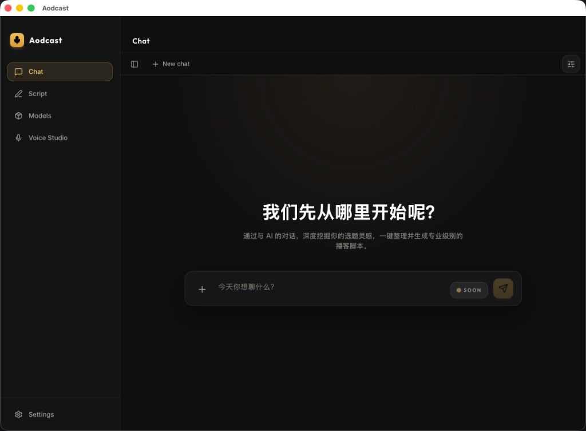
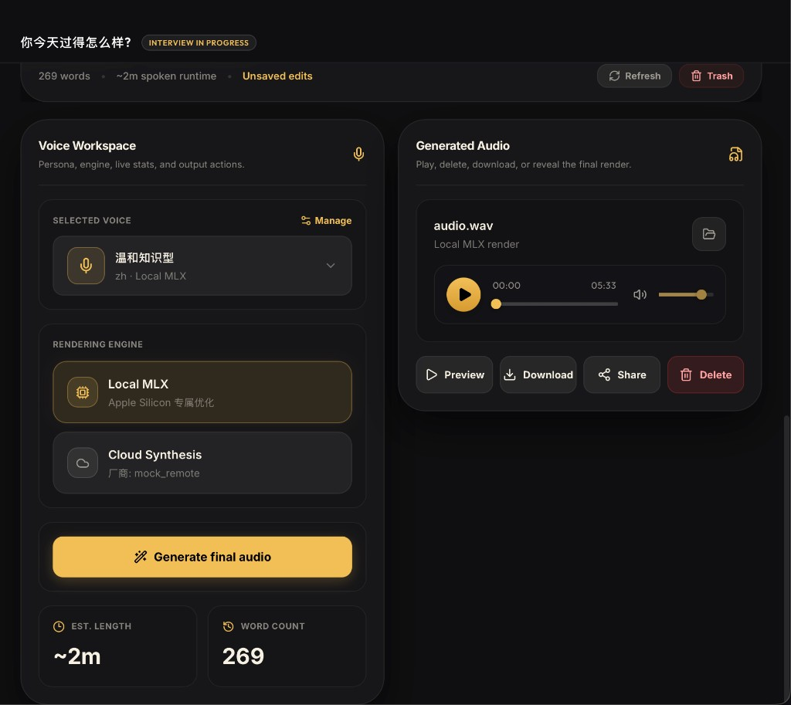
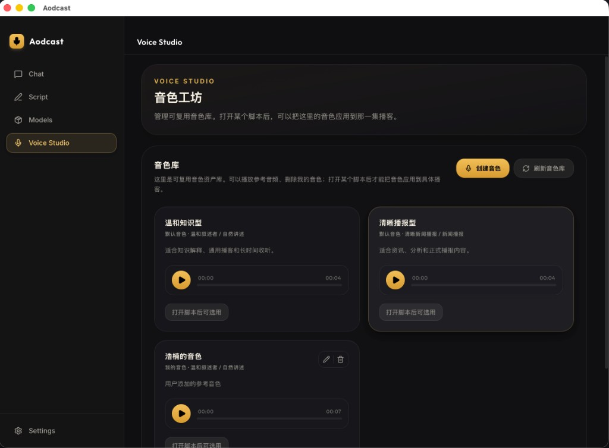

# Aodcast

[](https://github.com/Handsomemikezzz/Aodcast/actions/workflows/ci.yml)


[English](README.md) | 简体中文

Aodcast 是一个开源、本地优先的 macOS 桌面应用，用于把一个文本想法转成单人播客脚本和最终音频。

应用由 Tauri 桌面壳和本地 Python HTTP runtime 组成。它会引导用户完成访谈、生成可编辑的脚本快照、选择可复用的音色档案，并通过本地或远程语音 provider 渲染最终音频。

> 当前状态：源码级 alpha。Aodcast 可用于本地开发和验证，但还不是经过完整加固的桌面发行版。Provider key 和生成内容存储在本机；目前没有 macOS Keychain 或专用密钥保险库集成。

## 当前可用能力

- 基于文本主题的访谈式播客创作流程。
- 一个访谈 session 可以生成多个独立脚本快照。
- Script Workbench 支持编辑、保存、删除未使用快照、选择音色档案、渲染和回听生成音频。
- Voice Studio 支持内置和用户创建的音色档案、样本上传/录音、预览渲染和档案管理。
- 支持本地 MLX TTS，也支持 OpenAI-compatible 远程 provider。
- Models 页面支持本地模型存储、下载、迁移、重置和默认本地语音模型选择。
- Mock LLM/TTS provider 可用于无付费 API、无本地模型权重的 smoke test。
- 开发期本地数据默认存储在 `.local-data/`。

## 截图

### Chat

从访谈入口开始一个新 session。



### Script Workbench

编辑脚本、选择音色与渲染引擎，并生成/回听最终音频。



### Voice Studio

管理内置与用户创建的音色档案，再应用到具体脚本。



后续如需更新截图：运行 `./scripts/dev/run-dev-all.sh`，截取当前界面，以稳定文件名保存到 `images/`，并同步更新 `README.md` 与 `README.zh-CN.md`。请勿包含 API key、本地路径、私人 prompt 或用户数据。

## 环境要求

- macOS，用于运行桌面应用
- Python 3.13+
- `uv`
- Node.js
- `pnpm`
- Rust 和 Cargo
- `curl` 和 `lsof`，用于开发启动脚本

检查本机工具链：

```bash
./scripts/dev/check-toolchain.sh
```

## 快速启动

在仓库根目录执行：

```bash
cd services/python-core
uv venv .venv
uv pip install --python .venv/bin/python -e .

cd ../../apps/desktop
pnpm install

cd ../..
./scripts/dev/run-dev-all.sh
```

`run-dev-all.sh` 会在 `127.0.0.1:8765` 启动 Python runtime，清理过期开发服务状态，并启动 Tauri 桌面应用。Vite Web 服务地址是 `http://localhost:1420`。

## 第一次 Smoke Test

建议先使用 mock provider。这样无需付费 API，也无需下载本地模型权重，就能验证主流程：

```bash
./scripts/dev/run-python-core.sh --configure-llm-provider mock
./scripts/dev/run-python-core.sh --configure-tts-provider mock_remote
./scripts/dev/run-python-core.sh --create-demo-session
./scripts/dev/run-dev-all.sh
```

进入应用后，创建或打开一个 session，继续访谈，生成脚本，然后在 Script Workbench 中渲染音频。

## Provider 配置

### OpenAI-Compatible Provider

配置 OpenAI-compatible LLM provider：

```bash
./scripts/dev/run-python-core.sh \
  --configure-llm-provider openai_compatible \
  --llm-base-url "https://api.openai.com/v1" \
  --llm-model "gpt-4o-mini" \
  --llm-api-key "<your-key>"
```

配置 OpenAI-compatible TTS provider：

```bash
./scripts/dev/run-python-core.sh \
  --configure-tts-provider openai_compatible \
  --tts-base-url "https://api.openai.com/v1" \
  --tts-model "gpt-4o-mini-tts" \
  --tts-api-key "<your-key>" \
  --tts-voice "alloy" \
  --tts-audio-format "wav"
```

更多 provider、环境变量和 API key 处理说明见 [Configuration](docs/configuration.md)。

### Local MLX TTS

Local MLX 对基础开发不是必需项。只有在支持的 macOS 机器上，尤其是 Apple Silicon，并且有足够磁盘和统一内存时，才建议启用。

安装可选依赖：

```bash
cd services/python-core
uv pip install --python .venv/bin/python -e '.[local-mlx]'
cd ../..
```

下载默认模型：

```bash
uv run --with huggingface_hub --with tqdm \
  scripts/model-download/download_qwen3_tts_mlx.py \
  --base-dir "${HF_HUB_CACHE:-$HOME/.cache/huggingface/hub}"
```

选择 `local_mlx` 前先检查能力：

```bash
./scripts/dev/run-python-core.sh --show-local-tts-capability
```

配置 repo-id 模式的 Local MLX：

```bash
./scripts/dev/run-python-core.sh \
  --configure-tts-provider local_mlx \
  --clear-tts-local-model-path
```

模型存储、排错和硬件说明见 [Local MLX quickstart](docs/local-mlx-quickstart.md)。

## 开发命令

启动桌面应用和本地 runtime：

```bash
./scripts/dev/run-dev-all.sh
```

只启动 Python runtime：

```bash
./scripts/dev/run-python-core.sh --serve-http --host 127.0.0.1 --port 8765
```

前端检查：

```bash
pnpm --dir apps/desktop check
pnpm --dir apps/desktop build:web
```

Tauri Rust 检查：

```bash
cd apps/desktop/src-tauri
cargo check
```

Python 测试：

```bash
cd services/python-core
.venv/bin/python -m unittest discover -s tests -v
```

仓库 hygiene 检查：

```bash
./scripts/maintenance/run-repo-hygiene-check.sh
```

## 仓库结构

- `apps/desktop`：Tauri UI、React 路由、桌面命令和前端 bridge。
- `services/python-core`：访谈编排、脚本生成、provider 分发、本地存储、artifact 和 HTTP runtime。
- `packages/shared-schemas`：前后端共享 contract schema。
- `scripts`：开发、维护、发布和模型下载脚本。
- `docs/product`：产品行为说明。
- `docs/architecture`：架构和仓库结构说明。
- `docs/operations`：维护和 agent workflow 文档。
- `examples`：轻量示例和占位样例。

常用文档：

- [Product overview](docs/product/product-overview.md)
- [Configuration](docs/configuration.md)
- [Local MLX quickstart](docs/local-mlx-quickstart.md)
- [Repository layout](docs/architecture/repository-layout.md)
- [Contributing guide](CONTRIBUTING.md)
- [Security policy](SECURITY.md)

## 数据与隐私

Aodcast 是本地优先应用。开发期间，生成的 session、脚本、transcript、音频 artifact、provider 配置和 request-state 文件存储在：

```text
.local-data/
```

该目录已被 Git 忽略，不应提交。

API key 作为本地用户配置保存。Aodcast 目前没有 macOS Keychain 或专用密钥保险库。请保护本地配置文件、shell history、日志、截图、备份、同步目录、生成 transcript 和生成音频。

不要在公开 issue 或 PR 中提交 API key、私人 prompt、私人生成内容、本地数据路径、transcript 或音频 artifact。

## 当前范围

Aodcast 当前聚焦本地优先的单人播客创作。仓库不包含语音转文本输入、长期用户记忆、云端后端托管、多主持人播客格式或 voice cloning。

应用可以服务常见音频后缀，并且在 `ffmpeg` 或 `afconvert` 可用时，把部分上传的 profile 样本准备成 Local MLX 兼容的 WAV reference。压缩音频导出依赖本机转换工具。真正的视频 MP4 输出不在当前范围内。

## 贡献

欢迎贡献。请保持变更小而可审查；当用户流程、存储形状、provider 配置、runtime 行为或开发流程变化时同步更新文档。

不要提交 `.local-data/`、`.env`、模型权重、生成音频、transcript、虚拟环境、`node_modules`、构建产物或私人凭据。

完整贡献说明见 [CONTRIBUTING.md](CONTRIBUTING.md)。

## 安全

如果发现漏洞，请不要在公开 issue 中披露利用细节。请发送到 `cxh1210@mail.ustc.edu.cn`，或按照 [SECURITY.md](SECURITY.md) 的私密报告方式处理。

## License

Aodcast 使用 [MIT License](LICENSE)。
